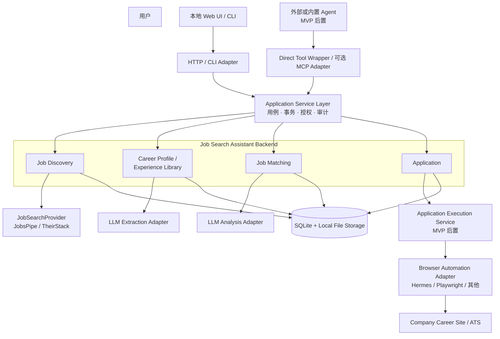
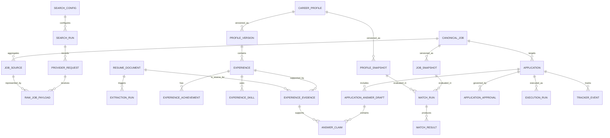
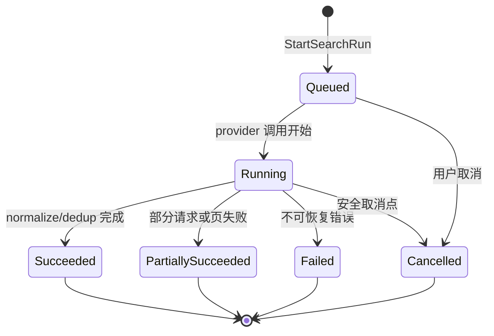
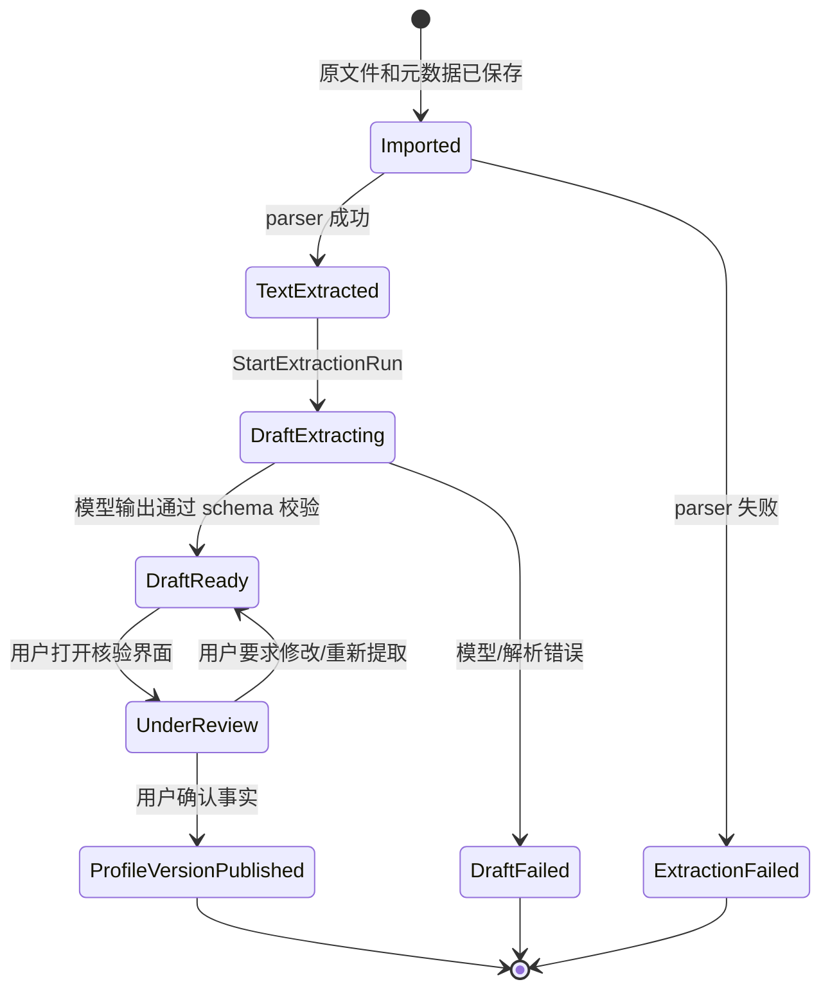
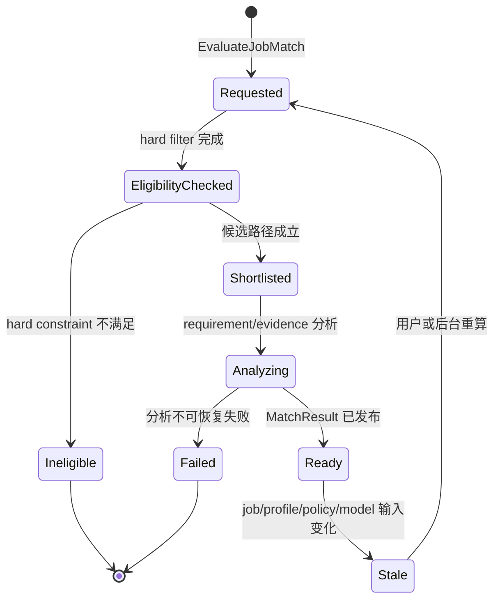
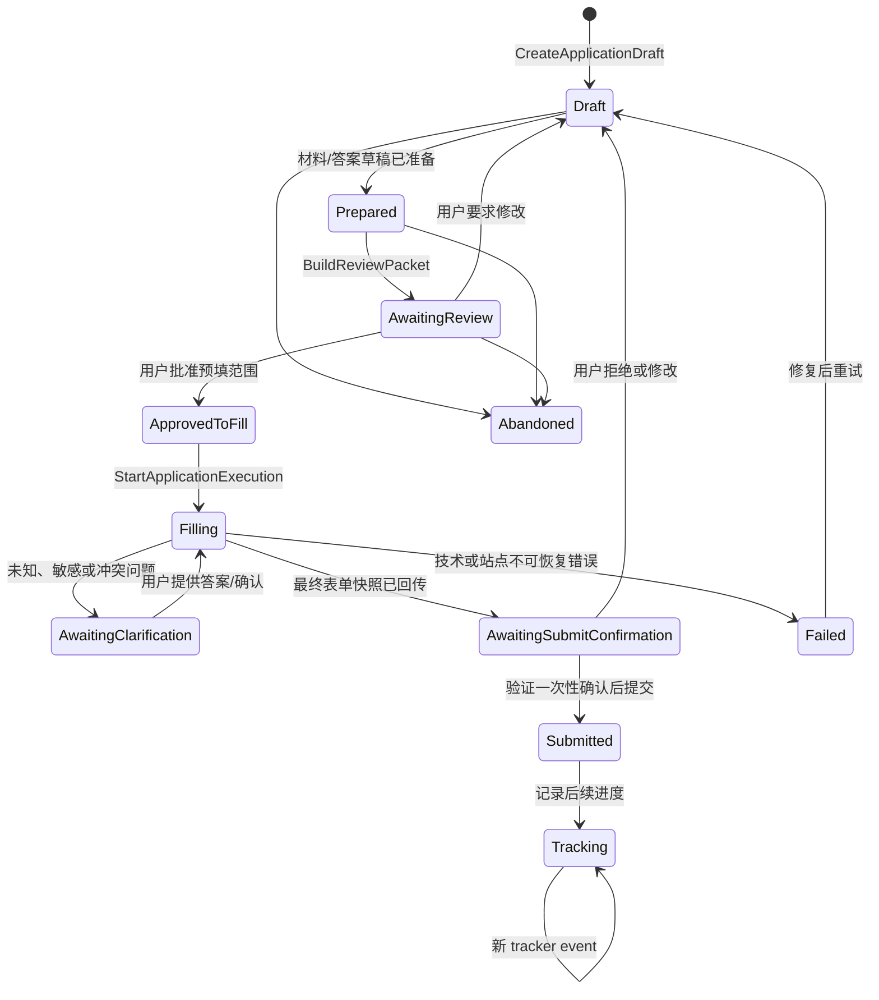

# Job Search Assistant 技术架构文档

| 文档属性 | 内容 |
|---|---|
| 状态 | Architecture Baseline v0.1 |
| 作者 | Manus AI |
| 最后更新 | 2026-08-27 |
| 系统阶段 | 单用户、本地优先 MVP；后续支持 Agent 与浏览器辅助申请 |
| 文档目的 | 规定系统边界、领域职责、接口契约、数据模型、安全控制与分阶段实施顺序。 |

## 1. 文档目的与决策状态

本文是 Job Search Assistant 的正式技术架构基线。它将已经确认的设计决策、明确排除的 MVP 能力和必须经实测才可启用的能力区分开来。本文的目标不是预先锁死所有实现细节，而是为后续编码提供一组稳定的边界与不变量，使 JobsPipe → TheirStack、人工操作 → scheduler、无 Agent → 多 Agent runtime、手工申请 → 受控浏览器辅助申请等演进不需要推翻核心数据模型。

系统的长期价值来自可追溯的职位数据、经用户确认的职业事实、可解释的匹配判断和可审计的申请记录。Agent、MCP、LLM provider 与浏览器驱动均为可替换的外围能力，不能成为这些核心资产的唯一入口或事实来源。

> **架构总原则：** 任何不需要自然语言理解的操作均采用确定性实现；任何会对外产生影响的操作均由后端状态机、权限范围与审计记录约束；任何候选人事实性表述均必须可追溯到经用户确认的证据。

## 2. 系统范围

### 2.1 MVP 范围

MVP 是一个单用户、个人使用、在本地运行的 Job Search Assistant。用户主动设置或输入搜索条件，系统使用唯一启用的职位 Provider（首版为 JobsPipe）发现职位，长期保存原始 Provider 响应，完成规范化、去重、展示，并基于个人 Career Profile / Experience Library 生成可解释的职位匹配结果。用户可以建立 Application 记录和追踪状态，但 MVP 不自动投递。

| MVP 内能力 | MVP 外能力 |
|---|---|
| 手动触发职位搜索、SearchRun 记录与 JobsPipe Provider | 多用户、用户认证、正式云部署 |
| 原始职位/简历/LLM 输出/用户修改的长期留存 | scheduler、每日刷新、自动通知 |
| canonical job、provider identity 与分层去重 | 多 Provider 同时运行、全量 ATS 自维护 |
| 简历解析、LLM 结构化草稿与用户逐项核验 | 自动投递、浏览器 fallback 的职位发现 |
| Career Profile、Experience Library、Job Matching、Application 数据模型 | 复杂全局 ranking、批量无人审核决策 |
| HTTP/CLI/UI 适配与可选 Agent-ready 内部工具契约 | 远程 MCP 公网部署、凭空假定的 Hermes 文件上传能力 |

### 2.2 明确的非目标

系统在 MVP 阶段不解决跨用户协作、分布式服务伸缩、自动搜集网站登录凭据或绕过招聘网站的安全机制。它也不会把匹配分数直接转化为申请决定，或在没有用户即时确认的情况下提交任何申请。遇到登录、CAPTCHA、未知/敏感问题或站点异常时，未来的自动化流程必须暂停并将控制权交回用户。

### 2.3 技术决策等级

| 标签 | 含义 | 示例 |
|---|---|---|
| **已确认** | 已作为本版本架构的约束，后续实现必须遵守。 | 四模块、verified evidence、提交前确认。 |
| **MVP 后置** | 系统为未来扩展预留接口，但当前不实现完整功能。 | MCP Server、Agent runtime、browser automation、scheduler。 |
| **待验证** | 不得作为产品承诺或关键依赖，需以目标环境实验确认。 | Hermes 文件上传、各 ATS 表单兼容性、远程 MCP Host 互操作。 |

## 3. 总体架构

### 3.1 推荐的运行形态

系统采用 **modular monolith（模块化单体）**：一个本地后端应用、一个本地数据库和一组清晰隔离的领域模块。模块化不表示共享任意表和任意 repository；每个模块必须拥有自己的实体、不变量、迁移和写操作。跨模块的协作通过应用服务的 command/query 契约、版本化快照和只读投影完成。

在当前规模下，微服务、独立数据库、消息队列和多个 MCP Server 会制造部署、事务、日志与版本协调成本，却没有带来独立伸缩收益。模块化单体为未来服务拆分保留路径：只有出现独立部署、独立权限边界、独立团队维护或对外复用需求时，才将已有模块契约抽为服务边界。



### 3.2 依赖方向与分层规则

领域模块不依赖 HTTP、MCP、浏览器、特定 LLM、特定 ORM 或 UI 框架。Application Service Layer 可以编排领域模块，但不应泄漏数据库实体。Adapter 层负责 I/O 与协议转换；它可以依赖应用服务，但应用服务不能反向依赖 adapter 的实现。

| 层 | 主要职责 | 允许依赖 | 禁止依赖 |
|---|---|---|---|
| Domain | 实体、值对象、领域不变量、状态迁移规则 | 标准库、领域抽象 | HTTP、MCP、浏览器 SDK、LLM SDK、ORM 具体实现 |
| Application Service | command/query、事务、跨域只读协调、授权、审计 | Domain ports/repositories | UI/controller、直接 browser/LLM/provider 调用 |
| Infrastructure Adapter | SQLite repository、JobsPipe、LLM、文件、browser driver | 应用服务定义的 port/schema | 领域表的越权写入、业务状态机重实现 |
| Delivery Adapter | REST/HTTP、CLI、UI、MCP tool wrapper | Application Service Contract | SQL、ORM entity、provider-specific payload |
| Agent/Skill | 工具选择、上下文理解、草稿生成、受限编排 | 公开的 tool/API contract | 数据库连接、无范围的提交或浏览器会话 |

### 3.3 部署基线

本地 MVP 中，SQLite 保存结构化查询数据与必要的原始 JSON 元数据；原始 PDF/DOCX/TXT 与可能较大的 payload 可保存至受控本地文件路径，并由数据库记录 content hash、存储引用、加密/权限信息和保留状态。UI 可以调用同机 HTTP adapter 或进程内 SDK；两者不得直接打开数据库文件。

对于未来 Agent，系统应首先支持**进程内/同机 direct tool wrapper**。当真实需要让多个外部 Agent Host 连接同一产品能力时，再增加一个 product-level MCP Server。MCP 的作用是向 Agent Host 暴露 tools、resources 和 prompts 的标准方式，并不替代业务 API、领域状态或授权逻辑。[1] [2]

## 4. 关键术语

| 术语 | 定义 |
|---|---|
| **Canonical Job** | 系统归并后的职位实体；可以由一个或多个 provider source 支持。 |
| **Job Source** | 某一个 Provider 对外部职位的记录，使用 `provider + external_id` 识别。 |
| **Job Snapshot** | 某次处理后可供其他模块读取的、版本化的 canonical job 视图。 |
| **Verified Evidence** | 用户已确认的职业事实或其来源片段，可用于匹配和对外申请表述。 |
| **VerifiedEvidencePack** | 面向某一 profile/任务上下文的、最小化且可追溯的 verified evidence 集。 |
| **Match Result** | 在指定 job、profile、policy、模型/提示词版本下生成的匹配判断；属于可再计算派生数据。 |
| **Application** | 用户对某个职位作出的明确申请意图，以及材料、答案、审批、执行和追踪记录。 |
| **Application Agent** | 读取受限上下文并调用工具准备或执行已批准申请的可替换 Agent runtime。 |
| **Approval Token** | 由 Application 服务签发的、绑定申请与表单快照、时间有限且可一次性使用的用户确认凭证。 |

## 5. 架构不变量

系统的后续实现必须持续满足下列不变量。职位原始数据不可被规范化结果覆盖；LLM 输出不可被自动升级为 verified fact；Matching 不得回写职位或 Career 事实；Application 历史材料不得随 profile 编辑而变化；Agent 不得直接持有数据库写权限；最终提交不得仅凭 Agent 的文本判断，而必须验证用户确认、当前状态和最终表单快照。

这些不变量比任何具体框架、通信协议或模型供应商更重要。它们确保系统即使替换 JobsPipe、Hermes、MCP 或模型提供商，仍保持数据正确性、可审计性与用户控制权。


## 6. 领域模型与模块边界

### 6.1 四个模块的事实所有权

四个模块的边界以“谁拥有何种业务真相”定义，而不是以页面、HTTP 路由或某张数据库表定义。模块可以读取其他模块发布的只读快照，但不得绕过其应用服务写入对方拥有的实体。

| 模块 | 拥有的业务真相 | 输入 | 对外发布的输出 | 明确不拥有 |
|---|---|---|---|---|
| **Job Discovery** | 外部职位来源、原始响应、搜索运行、规范化职位、canonical job、去重/合并决策、观察时间 | SearchConfig、trigger context | JobSnapshot、SearchRun、JobChanged/JobSeen | 候选人经历、匹配结论、申请状态 |
| **Career Profile / Experience Library** | 原始简历、提取文本、LLM 草稿、用户确认的经历/技能/证据、profile 与材料版本 | 文档上传、用户修订、确认动作 | CareerProfileSnapshot、VerifiedEvidencePack、ProfileChanged | 职位内容、match score、申请生命周期 |
| **Job Matching** | 匹配策略、职位要求派生分析、候选集、匹配运行、分数、解释、缺口、不确定性、缓存/失效 | JobSnapshot、CareerProfileSnapshot、VerifiedEvidencePack、policy | MatchResult、MatchResultStale | 职位与职业事实的写权限、创建申请 |
| **Application** | 用户投递意图、申请快照、材料/答案版本、审批、自动化执行、提交回执和求职进度 | JobSnapshot、EvidencePack、可选 MatchResult、用户命令 | Application、ReviewPacket、Approval、ExecutionRun、TrackerEvent | Provider 搜索、Career 事实核验、匹配规则定义 |

上述定义使 Job Matching 成为真正可独立测试、版本化和复用的模块，同时防止它变成另一个“事实库”。MatchResult 可以说明“某项经历可能支持某个岗位要求”，但不能创建新的 `experience`，也不能把某项未核验文本提升为 verified evidence。

### 6.2 领域关系图



### 6.3 Job Discovery 领域模型

Job Discovery 应区分发现过程、原始来源与系统内职位身份。`SearchRun` 是一次完整的业务操作，不是某个 HTTP 请求的日志；它保存可重放、可诊断的触发信息。`JobSource` 是某 Provider 所见职位，`CanonicalJob` 是系统在可审计合并规则下归并后的业务对象。

| 实体或值对象 | 关键字段 | 生命周期和不变量 |
|---|---|---|
| `SearchConfig` | query、locations、work_modes、experience_level、hard_constraints、preferred_constraints、version | 不暴露 Provider 内部字段。变更产生新版本或带版本快照的 SearchRun。 |
| `SearchRun` | id、trigger_type、provider、query_snapshot、started_at、completed_at、status、request_count、result_count、error_summary | 由 manual/scheduled trigger 创建；搜索业务逻辑不得写入 controller。 |
| `ProviderRequest` | run_id、request_sequence、provider_request_snapshot、http metadata、requested_at、status | 适当脱敏，不保存会暴露秘密的 header/value。 |
| `RawJobPayload` | provider、external_id、content_hash、raw_json_ref、observed_at | 原始数据追加保存或按 hash 去重；不被 normalization 覆盖。 |
| `JobSource` | provider、external_id、canonical_url、original_url、normalized fields、first_seen_at、last_seen_at | `provider + external_id` 唯一；是第一层去重键。 |
| `CanonicalJob` | id、company、title、location、canonical_url、current_snapshot_id、status | 由一个或多个 source 支持；合并应可审计并允许人工纠正。 |
| `JobSnapshot` | job_id、content_hash、normalized content、source summary、created_at | 不可变；供 Matching 和 Application 引用。 |

职位时间必须分开保存：`posted_at` 表示 Provider/ATS 声称的发布时间；`first_seen_at` 表示系统第一次发现该 source/job 的时间；`last_seen_at` 表示最近一次观察到该记录的时间。UI 不得把“Provider 声称今日发布”和“系统今天首次看到”混为同一标签。

#### Discovery 的分层去重

第一层去重由 `provider + external_id` 完成，确保同一个 JobsPipe 结果不会重复创建 source。第二层归并在 canonical job 层进行，使用 canonicalized URL、original source URL、employer/domain、normalized title、location、发布日期和 description/content hash 生成候选关系。系统应记录 `merge_reason`、`merge_confidence`、`policy_version` 和必要的人工覆盖，而不应将任意模糊匹配静默当成同一职位。

### 6.4 Career Profile / Experience Library 领域模型

Career 模块的目标是构建可追溯的候选人职业知识库。它必须保护“资料原文”“模型草稿”“用户确认事实”三者的差异，以便未来替换 parser/LLM、重新提取和生成不同版本材料而不丢失证据链。

| 实体或值对象 | 关键字段 | 生命周期和不变量 |
|---|---|---|
| `ResumeDocument` | id、file_ref、mime_type、content_hash、uploaded_at、parser_version、extracted_text_ref | 原文件和提取文本保留；替换文件创建新 document/version。 |
| `ExtractionRun` | id、document_id、model、prompt_version、schema_version、input_hash、output_ref、status、error | 模型输出只是一份草稿；允许失败、重跑和比较。 |
| `CareerProfile` | id、display_name、current_version_id、created_at、updated_at | 单用户 MVP 仍保留 owner/tenant 预留字段。 |
| `ProfileVersion` | id、profile_id、version、created_at、source_summary | 用户确认/重要编辑产生可引用版本。 |
| `Experience` | organization、role、date_range、summary、verification_status | 每个经历可关联多个 achievements、skills 与 evidence。 |
| `ExperienceAchievement` | action、outcome、metric、unit、verification_status | 数值/指标必须有来源或用户显式确认。 |
| `Skill` / `ExperienceSkill` | canonical_name、taxonomy_ref、proficiency/evidence association | 归一化以便 deterministic matching，但不抹去原文。 |
| `ExperienceEvidence` | source_document_id、source_excerpt、source_locator、confidence、user_verified、verified_at | 是支持可提交事实的最低粒度证据单元。 |
| `RevisionAudit` | entity_ref、before_snapshot、after_snapshot、actor、timestamp、reason | 任何用户修改或核验状态变化均应可回溯。 |

`user_verified = true` 的含义应足够严格：用户已确认该事实表述可作为自己的真实职业信息使用，而不只是“模型抽取得差不多”。对由多个原文片段组合而成的事实，保留多个 evidence reference；对用户新补充、但无文档来源的事实，仍要以 `source_type = user_assertion` 和确认时间记录，不应假装来源于简历。

### 6.5 Job Matching 领域模型

Job Matching 把职位要求与已核验职业证据联系起来，生成可解释但可失效的派生结果。该模块的最重要设计目标是避免让 LLM 对全量职位逐个阅读，并避免把概率性的语义结论写入事实表。

| 实体或值对象 | 关键字段 | 生命周期和不变量 |
|---|---|---|
| `MatchingPolicy` | id、version、hard_rule_spec、preferred_rule_spec、weights、taxonomy_version、explanation_policy | 策略变更不覆盖旧结果；新运行引用新 policy version。 |
| `JobRequirementAnalysis` | job_snapshot_id、requirements、source_spans、analysis_method、model/prompt/schema version | 是对 job snapshot 的派生解析；必须带 input hash 与可重算信息。 |
| `ProfileCapabilityProjection` | profile_version_id、normalized skills、evidence refs、recency/scope attributes | 只能由 verified evidence 投影生成。 |
| `MatchRun` | job/profile/policy refs、request type、status、candidate_count、started/completed_at | 长任务可独立记录和轮询，不依赖传输协议的 session。 |
| `MatchResult` | overall_score、hard_filter_passed、matched_skills、missing_requirements、evidence_links、uncertainties、generated_at | 是 advisory output；必须引用输入版本与 evidence IDs。 |
| `MatchInvalidation` | result_id、reason、invalidated_at | 输入内容、policy 或解析版本变化时触发。 |

匹配管道按成本由低至高运行。第一步只执行确定性的 hard eligibility；第二步通过 taxonomy、关键词、向量索引或轻量特征生成 shortlist；第三步才对新/变更岗位做结构化 requirement analysis；第四步在候选集上建立 requirement→verified evidence 映射、解释缺口与不确定性。任何 LLM 结果必须受 schema 校验，并以 job/profile/policy/model/prompt 的版本组合缓存。

### 6.6 Application 领域模型

Application 模块将用户的“我决定申请这个职位”建模为一个正式业务对象。它既要支持未来的 Agent 辅助，也要支持完全手工的记录和跟踪；因此 Agent 运行记录不能替代 Application 本体。

| 实体或值对象 | 关键字段 | 生命周期和不变量 |
|---|---|---|
| `Application` | id、job_id、job_snapshot_id、profile_version_id、status、intent_created_at、application_url | 创建代表用户明确申请意图；不要求先有 MatchResult。 |
| `ApplicationMaterialVersion` | application_id、material_type、source_profile_version、rendered_file_ref、content_hash、approved_at | 实际使用的简历/信件版本应不可变并可复现。 |
| `ApplicationAnswerDraft` | application_id、question_snapshot、rendered_answer、status、generated_by | 每一版答案独立保存；不能以新 profile 静默改写。 |
| `AnswerClaim` | answer_id、claim_text、support_type、evidence_ids、verification_status | 每一事实性 claim 必须映射 verified evidence 或成为 unresolved item。 |
| `ApplicationApproval` | scope、snapshot_hash、issued_at、expires_at、consumed_at、actor | 批准必须绑定具体 application 与审阅快照；token 一次性有效。 |
| `ExecutionRun` | application_id、executor_type、agent/runtime version、skill_version、browser backend、status | 保存浏览器/Agent 执行尝试，不等同于 Application status。 |
| `ExecutionEvent` | run_id、sequence、event_type、page_snapshot_ref、action_summary、error | 形成可审计时间线；敏感内容必须脱敏或加密。 |
| `ApplicationTrackerEvent` | application_id、event_type、occurred_at、source、notes | 支持 Applied、Assessment、Interview、Offer、Rejected、Withdrawn 等状态演进。 |

## 7. 模块契约与应用服务

### 7.1 契约设计原则

模块暴露的接口应表达用户意图和业务结果，不应暴露表名、SQL、ORM entity 或 Provider-specific 字段。每个写命令应校验当前状态、记录 actor 和 correlation ID，并支持幂等键；每个对外读取应以 snapshot、分页、最小数据暴露和版本字段为基础。

`Application Service Contract` 是全系统权威的应用层接口。REST/HTTP、CLI、测试 SDK、内部 Agent tool wrapper 与未来 MCP tool 都调用相同服务。MCP 的 tools/resources/prompts 适合承载 Agent-facing 适配，但 MCP 不规定业务工作流或状态管理，因此不能取代这些领域服务。[1] [2]

### 7.2 Job Discovery 契约

| 用例 | 建议 command/query | 输入 | 成功输出 | 约束 |
|---|---|---|---|---|
| 创建或更新搜索配置 | `SaveSearchConfig` | canonical SearchConfig、expected version | config ref/version | 验证 hard/preferred schema；禁止 Provider 私有字段。 |
| 发起搜索 | `StartSearchRun` | config ref/version、trigger context、idempotency key | search_run_id、status | MVP 只允许 `manual` 和一个已启用 Provider。 |
| 查询运行进度 | `GetSearchRun` | run ID | counts、status、errors、result refs | 不泄露敏感 provider credential。 |
| 查询职位 | `ListJobs` / `GetJobSnapshot` | filter、cursor / job ID | canonical job snapshot | 返回 `posted_at` 与 first/last seen 的明确语义。 |
| 修正归并 | `OverrideJobMergeDecision` | candidate refs、decision、reason | revised canonical association | 需要 audit，不得删除原始 source。 |

`StartSearchRun` 可以在 UI 中同步等待，也可以返回 run ID 后轮询；其领域语义不依赖 scheduler 或 MCP Tasks。未来 scheduled trigger 只需构造不同的 trigger context，并调用同一 command。

### 7.3 Career 契约

| 用例 | 建议 command/query | 输入 | 成功输出 | 约束 |
|---|---|---|---|---|
| 导入简历 | `ImportResumeDocument` | file ref、metadata、idempotency key | document ID、parse status | 原文件 content hash 必须保存；病毒/格式检查位于 adapter。 |
| 生成抽取草稿 | `StartExtractionRun` | document ID、extractor policy | extraction run ID | 输出只能为 draft，记录 model/prompt/schema/input hash。 |
| 用户核验经历 | `ConfirmExperienceFacts` | profile version、draft changes、evidence refs | new profile version | 只有显式确认的项才能为 verified。 |
| 查看职业摘要 | `GetCareerProfileSnapshot` | profile ref/version | snapshot | 默认最小化返回，不等同于原始简历全文。 |
| 获取可信事实包 | `GetVerifiedEvidencePack` | profile ref/version、task context | evidence pack | 返回项必须带 evidence ID、scope、verified state。 |

### 7.4 Job Matching 契约

| 用例 | 建议 command/query | 输入 | 成功输出 | 约束 |
|---|---|---|---|---|
| 匹配指定职位 | `EvaluateJobMatch` | job snapshot、profile version、policy ref、idempotency key | match run/result ref | 先执行 hard filter；结果必须带完整版本元数据。 |
| 寻找合适职位 | `FindMatchingJobs` | search scope、profile version、policy ref、limit | ranked/paginated match refs | 只在 shortlist 上使用昂贵分析。 |
| 查看解释 | `GetMatchResult` / `ExplainMatchResult` | match ID | score、evidence links、gap、uncertainties | 不隐藏结果的新鲜度或 stale 状态。 |
| 更新策略 | `PublishMatchingPolicy` | policy spec、effective time | policy version | 旧结果仍绑定旧策略；不得静默重写历史。 |

### 7.5 Application 契约

| 用例 | 建议 command/query | 输入 | 成功输出 | 约束 |
|---|---|---|---|---|
| 创建申请草稿 | `CreateApplicationDraft` | job snapshot、profile/material version、用户意图 | application ID、Draft status | 用户须显式触发；MatchResult 仅可选作参考。 |
| 保存答案草稿 | `SaveAnswerDraftWithClaims` | question snapshot、answer text、claims、evidence IDs | answer version | 后端校验 claim evidence；不支持的事实进入 unresolved。 |
| 生成审阅包 | `BuildApplicationReviewPacket` | application ID | materials、answers、evidence、risk flags | 审阅包 hash 成为 approval 输入。 |
| 批准预填 | `ApproveApplicationFill` | application ID、review packet hash、allowed scopes | fill approval token | 绑定版本、范围和过期时间。 |
| 启动获批执行 | `StartApplicationExecution` | application ID、fill approval token、executor selection | execution run ID | 仅能执行已批准字段；记录 browser/agent metadata。 |
| 请求提交确认 | `RequestSubmitConfirmation` | application ID、final form snapshot hash | pending confirmation | 页面或答案变化后旧确认失效。 |
| 真正提交 | `SubmitApplication` | application ID、one-time confirmation token | submitted status / receipt ref | 后端验证状态、token、hash、一致性与未消费状态。 |
| 更新申请进度 | `RecordApplicationTrackerEvent` | application ID、event type、source/notes | updated timeline | 不允许 Agent 任意设置非法 status。 |

### 7.6 Agent/MCP 适配契约

当未来引入 MCP 时，MCP Server 只映射上述服务为少量领域化 tools、resources 和可选 prompts。MCP 的 2026-07-28 规范已提供无状态请求核心、能力发现、缓存提示和扩展机制，适合横向运行的工具接入；但应用状态仍需由本系统通过显式 ID/handle 与数据库管理。[2] [3]

初始 MCP 工具面应保持精简，并按 token scope 区分只读、准备、执行、提交权限。`search_jobs` 可以映射 `StartSearchRun + GetSearchRun`，而非直接暴露 Provider 参数；`get_verified_evidence_pack` 不应默认返回完整简历；`submit_application` 必须执行与 UI 相同的 confirmation token 校验。

| MCP 表面类别 | 建议资源或工具 | 允许范围 |
|---|---|---|
| 只读资源 | `job://{id}/snapshot`、`career://{profile}/verified-evidence`、`match://{id}`、`application://{id}/review` | 受 application/profile scope 约束，返回最小必要数据。 |
| Discovery tools | `start_job_search`、`get_search_run`、`list_jobs` | 仅用户允许的 config/provider；返回 run ID 或分页结果。 |
| Matching tools | `evaluate_job_match`、`find_matching_jobs` | 不允许写 Career 或自动创建 Application。 |
| Application preparation | `create_application_draft`、`save_answer_draft_with_claims`、`request_fill_approval` | 全部经状态机和 evidence 校验。 |
| 高风险动作 | `start_approved_execution`、`request_submit_confirmation`、`submit_application` | 必须具备对应短时、绑定范围的批准凭证。 |

## 8. 数据模型与持久化设计

### 8.1 持久化原则

结构化主表用于查询、过滤、状态流转和关系完整性；raw tables 或文件存储用于保存完整原始响应与输入文档；run tables 用于记录 LLM 和外部执行；audit tables 用于保存用户修改与风险动作。任一领域主表都不应以一列万能 JSON 代替其稳定、可查询的核心字段，但为保存原始 payload、可演进的 Provider metadata 和模型输出可以使用受控 JSON/blob reference。

所有版本化计算应使用 content hash 与版本组合。更新不会覆盖历史 run、raw payload、profile version、application material 或已提交表单快照；新版本通过新的记录和 current pointer 表达。删除策略应采用逻辑删除、保留期和受控物理清除，而不是由任一模型或 Agent 直接删除历史。

### 8.2 推荐表组与核心约束

| 表组 | 核心表 | 主键/唯一性与索引建议 | 数据保留要求 |
|---|---|---|---|
| Discovery Config & Runs | `search_configs`、`search_config_versions`、`search_runs`、`provider_requests` | `search_runs(trigger, config_version, idempotency_key)` 唯一；按 status/started_at 索引 | 保存 query snapshot、provider、错误摘要与脱敏 request metadata。 |
| Discovery Raw & Canonical | `raw_job_payloads`、`job_sources`、`canonical_jobs`、`job_snapshots`、`job_merge_decisions` | `job_sources(provider, external_id)` 唯一；URL/hash/company-title-location 候选索引 | 长期保存 raw JSON ref/content hash 及 merge audit。 |
| Career Documents & Facts | `resume_documents`、`document_texts`、`llm_extraction_runs`、`career_profiles`、`profile_versions`、`experiences`、`experience_achievements`、`skills`、`experience_skills`、`experience_evidence` | documents hash；profile version；evidence verification/status 索引 | 保存原文件、文本、抽取输出、prompt/model/schema 与用户修订记录。 |
| Matching | `matching_policies`、`job_requirement_analyses`、`profile_capability_projections`、`match_runs`、`match_results`、`match_evidence_links`、`match_invalidations` | `(job_snapshot, profile_version, policy_version, input_hash)` 缓存/幂等索引 | 保存每一次可见结果所用版本、计算方法与 uncertainty。 |
| Application | `applications`、`application_material_versions`、`application_questions`、`application_answer_drafts`、`answer_claims`、`answer_claim_evidence`、`application_approvals`、`execution_runs`、`execution_events`、`application_tracker_events` | application status；approval token digest；execution sequence；claim-evidence relation | 保存审阅/提交快照、实际材料、回执、Agent/browser metadata。 |
| Audit & Operations | `audit_events`、`idempotency_keys`、`outbox_events`（后置） | `(scope, idempotency_key)` 唯一；correlation ID 索引 | 用户确认、敏感访问、失败与状态变化均可追溯。 |

### 8.3 跨模块引用和快照策略

Application 与 MatchResult 都引用 JobSnapshot 与 ProfileVersion，而不是仅引用可变的 `canonical_jobs.id` 和 `career_profiles.id`。Application 在创建或审批时还应固定 `ApplicationMaterialVersion` 与可使用的 evidence refs。这样用户后续更新简历、职位 Provider 更新描述或 Matching 改变策略时，历史申请的事实基础仍能完整复现。

Matching 结果可以保存 evidence ID 引用而非完整复制 evidence 原文；展示时按权限读取原文片段。Application 审阅/提交记录则应保存必要的不可变 evidence snapshot 或哈希，以应对原始材料受保留策略影响而被清理的情形。任何敏感原文复制都必须遵循最小化原则并在存储层加密或受控访问。

### 8.4 原始数据、LLM run 与审计记录

| 数据类别 | 记录内容 | 为什么必须保留 |
|---|---|---|
| Provider raw data | 完整响应/单条 JSON、请求参数快照、请求时间、Provider ID、content hash、脱敏 HTTP metadata | 支持调试、重新规范化、Provider 替换、去重修正和算法演进。 |
| Document raw data | 原始 PDF/DOCX/TXT、提取文本、parser/version、content hash | 支持重新抽取、引用证据与用户复核。 |
| LLM run | task type、输入/输出 reference、model、prompt/schema version、token/cost telemetry、状态/错误 | 支持缓存、可复现性、质量评估与 prompt/model 替换。 |
| User revision | 修改前后快照、actor、时间、原因、确认对象 | 保护事实可信度，并解释为什么某项目被设为 verified。 |
| Automation run | agent/runtime/skill/browser backend、事件序列、页面/表单快照、错误与回执 | 支持用户审查、失败恢复和提交争议排查。 |


## 9. 执行状态机与工作流

状态机是系统保证可恢复性、幂等性和用户控制权的核心。它应由 Domain/Application Service 执行；UI、MCP tool、Agent 或 Browser Adapter 只能请求状态转移，不能直接修改 `status` 字段。每个转移记录 actor、correlation ID、原因、时间和必要的输入/输出快照。

### 9.1 SearchRun 状态机



| 转移 | 执行者 | 必须验证 | 必须记录 |
|---|---|---|---|
| `StartSearchRun → Queued` | UI/CLI/MCP adapter 通过服务 | SearchConfig 有效、Provider 已启用、idempotency key 未消费 | config version、query snapshot、trigger type、request actor。 |
| `Queued → Running` | SearchRunService | run 未取消、Provider 仍可用 | started_at、worker/executor metadata。 |
| `Running → Succeeded/PartiallySucceeded` | Discovery pipeline | raw payload 已持久化、normalization 与 source upsert 已完成 | request/result counts、canonical changes、warnings。 |
| `Running → Failed` | Discovery pipeline | 错误不可恢复或重试耗尽 | error class、sanitized details、retryability。 |

MVP 中只使用 `trigger_type = manual`。未来 scheduler 只会创建不同的 trigger context，不会拥有另一套搜索逻辑。对分页或 provider 限流，系统应在每一次 raw payload 成功持久化后设置检查点；重试必须依靠 run/request idempotency，而不是盲目重跑整个 pipeline。

### 9.2 Resume Extraction 与事实核验状态机



`DraftReady` 绝不等价于 `ProfileVersionPublished`。用户可以接受、编辑、拒绝或补充任何抽取项；只有确认动作创建新的 ProfileVersion。若模型以“推断”补全了原文没有的事实，该项必须被标记为需要澄清，不能带入 verified evidence。重跑 extraction 会创建新的 `ExtractionRun`，不覆盖旧输出。

### 9.3 MatchRun 状态机与结果失效



硬过滤不通过时，系统应返回明确、可解释的 `ineligible_reasons`，而非调用 LLM 生成含糊的低分。结果进入 `Stale` 而不是被直接重写；UI 和 Agent 都必须看见 freshness 状态。对于相同 `job_snapshot + profile_version + policy_version + analysis version` 的请求，服务优先返回缓存结果或单飞执行中的 run，防止重复 token 消耗。

### 9.4 Application 生命周期与确认闸门

Application 以用户主动创建为起点。未来的 Agent/Browser 流程只能在状态机预先授权的范围内执行，Agent 的文字声称“已投递”不会改变 Application status。



| Application 状态 | 允许的动作 | 禁止的动作 |
|---|---|---|
| `Draft` | 选择 job/profile、生成材料和答案草稿 | 启动浏览器、上传、提交。 |
| `Prepared` / `AwaitingReview` | 查看 claim/evidence、编辑答案、构建审阅包 | 任何外部表单填入或提交。 |
| `ApprovedToFill` | 签发 scope-bound fill approval | 自动扩大批准字段、替换已批准材料。 |
| `Filling` | 在批准范围内导航、预填、上传（能力实测后）、记录页面事件 | 对未知或敏感字段猜测答案；点击最终 Submit。 |
| `AwaitingClarification` | 请求用户补充或确认 | 继续填写需要澄清的字段。 |
| `AwaitingSubmitConfirmation` | 显示最终表单摘要、请求立即确认 | 使用旧表单或旧 token 提交。 |
| `Submitted` / `Tracking` | 保存回执、更新状态、人工记录进展 | 再次提交同一 application。 |

### 9.5 浏览器执行协议

浏览器自动化属于 `ApplicationExecutionService` 调度的 adapter。适配器可以由 Hermes、Playwright 或未来的其他 provider 实现，但其统一协议必须是结构化的。`ExecutionRun` 绑定 application、job snapshot、fill approval、material versions、agent runtime、skill version 与 browser backend。

```text
StartApplicationExecution(application_id, fill_approval)
  → 创建 ExecutionRun
  → 校验当前 Application / approval / material / evidence 状态
  → 在受限 browser session 中打开 application_url
  → BrowserObservation(page snapshot, discovered fields)
  → Answer/Field mapping 必须通过 evidence 和 scope 校验
  → BrowserAction(fill/click/upload) 逐条落审计事件
  → 遇到 stop condition 时进入 AwaitingClarification
  → 完成预填后保存 FinalFormSnapshot
  → RequestSubmitConfirmation(application_id, final_form_snapshot_hash)
  → 用户确认后，才允许 SubmitApplication
```

Hermes 的官方浏览器文档证实其可通过 `browser_navigate`、`browser_snapshot`、`browser_click`、`browser_type` 和 `browser_press` 等能力完成导航、读取可访问性树、填写文本字段和普通表单推进，并有可见浏览器模式供用户干预。[4] 因此 Hermes 可以作为此协议的一种 Browser Adapter。需要注意的是，官方浏览器工具清单未将文件上传列为稳定的内建工具，且官方仓库存在未关闭的 upload 工具暴露请求；简历上传必须暂时设计为可选 capability，并始终保留用户手工上传路径。[5]

## 10. 安全、可信度与治理策略

### 10.1 安全目标

本系统处理的资料包含简历、职业历史、求职意图、登录会话、申请问答和潜在敏感个人信息。安全设计的目标是确保用户知道哪些数据被访问、任何对外行为可追溯且可阻止、模型不能杜撰事实、失效或越权的 Agent/工具调用不会造成提交行为。

MCP 规范把用户同意与控制、数据隐私、工具安全列为关键原则，并明确指出协议不能自行强制这些原则。[1] 因此本系统不得将安全责任交给 MCP Host、Agent Skill 或模型提示词；授权、确认和审计必须在 Application Service 内实施。

### 10.2 安全控制矩阵

| 风险领域 | 风险 | 强制控制 | 责任模块 |
|---|---|---|---|
| 职业事实幻觉 | Agent/LLM 编造项目、指标、年限、技能或雇主信息 | `VerifiedEvidencePack`、claim→evidence 映射、持久化前/预填前/提交前三重校验 | Career + Application |
| 未授权投递 | Agent 直接点击 Submit 或重放旧命令 | 双确认、一次性短效 confirmation token、snapshot hash 绑定、状态机 | Application |
| 过度浏览器权限 | Agent 获取无范围登录会话、跨职位操作或读取不相关资料 | browser session 绑定 application/approval scope；专用 profile；最小页面/动作权限；完整 execution log | Application + Browser Adapter |
| 敏感字段误填 | 身份、残障、工作授权、薪资、法律声明被猜测 | field category policy；未知/敏感默认停止；用户需明确回答/确认 | Application |
| 数据泄露 | 原始简历或 provider payload 通过日志、MCP 或错误信息暴露 | 最小响应、字段脱敏、文件加密/受控路径、日志 redaction、scope/token | 全模块 + Adapter |
| Prompt injection | 职位描述/网页文本诱导 Agent 越权调用工具或泄露数据 | 将外部内容视作不可信数据；工具 allowlist；不以网页文本改变系统策略；高风险命令二次验证 | Agent Adapter + Application |
| 重复/错误提交 | 重试或页面异步导致重复申请 | idempotency key、submission receipt 检查、最终状态确认、禁止 Submitted 重入 | Application |
| Provider/LLM 成本失控 | 反复查询、重跑分析、Agent 重复工具调用 | 搜索/匹配 run 配额、content hash 缓存、single-flight、限速、cost telemetry | Discovery + Matching |

### 10.3 事实可信度策略

下表定义了资料在不同阶段允许做什么。只有最后一层可用于无需额外澄清的对外事实性申请表述。

| 信息层级 | 典型来源 | 可用于 Matching | 可用于 Application 草稿 | 可自动提交 |
|---|---|---:|---:|---:|
| 原始文档文本 | PDF/DOCX/TXT | 否，需经过 Career 投影 | 否 | 否 |
| LLM extraction draft | parser + LLM 输出 | 否，除非经用户确认 | 可作为待审阅建议 | 否 |
| 用户编辑但未确认 | UI 草稿 | 否 | 可展示供确认 | 否 |
| Verified evidence | 用户明确确认的事实/来源片段 | 是 | 是 | 仅在 claim 映射、审阅和提交确认均通过时 |
| 用户对特定问题即时回答 | Application clarification | 可选，通常不回写 Career 事实 | 是 | 仅对该 application、在用户确认范围内 |

`AnswerClaim` 的每一条事实性陈述必须拥有至少一个 verified evidence ID；复合陈述可关联多个 evidence ID，并标记为 `direct` 或 `synthesis`。不支持的内容不允许“低置信度提交”，而应进入 `unresolved_items`。用户对某个申请临时补充的信息需明确标注其来源与适用范围，不能自动推广成 Career 全局事实。

### 10.4 用户确认策略

确认应是有语义、有范围和可失效的领域对象，而不是 UI 上一个孤立的“确定”按钮。系统至少存在如下确认层级：

| 确认类型 | 确认的内容 | 有效范围 | 失效条件 |
|---|---|---|---|
| Fact Verification | 某项职业事实/证据可用 | Career Profile 版本 | 用户撤销或创建需重新确认的修订。 |
| Material Approval | 某份简历、信件或答案版本可用于指定申请 | application + material hash | 文件、答案或关联 profile version 变化。 |
| Fill Approval | 可在指定 application/页面中预填的字段类别与材料 | application + review packet hash + expiry | 页面/材料/答案变化、超时或用户撤销。 |
| Submit Confirmation | 可向当前最终表单快照实际提交 | application + final form snapshot hash + one-time expiry | 被消费、超时、表单变化、状态变化或用户撤销。 |

`SubmitApplication` 的处理必须为原子性操作：验证 Application 当前为 `AwaitingSubmitConfirmation`、token 未消费且未过期、token hash 与 final form snapshot 一致、没有未解决的强制问题，然后将 token 标记已消费并发出唯一提交命令。若 browser adapter 的结果不确定，状态应保持为 `SubmissionUnknown` 或等价的待人工核验状态，而不能乐观写为 `Submitted`。

### 10.5 Agent、Skill、MCP 与浏览器的最小权限

Agent 拥有推理和工具编排能力，但其权限应由短时 scope token 决定，而非由“该 Agent 看起来可信”决定。Skill 规定推荐操作顺序与禁区；它可由产品版本管理，但不能被当作安全边界。MCP 则是将有限业务能力暴露给外部 Agent Host 的协议适配，Server 应只发布最少工具、严格 schema 和明确的资源范围。[2] [3]

| 执行主体 | 可访问内容 | 可执行动作 | 不可执行动作 |
|---|---|---|---|
| UI/CLI | 用户选择的完整视图 | 创建/编辑/确认命令 | 绕过服务层直接写库。 |
| Agent | 最小化 job/profile/match/application snapshots | 起草、调用允许 tools、请求澄清 | 访问原始全量数据、确认事实、获得无限制浏览器权限。 |
| MCP Adapter | 经 scope 允许的资源/命令 | schema 验证后调用应用服务 | 直接 SQL、绕过审批、跨 profile 任意读取。 |
| Browser Adapter | application URL、获批字段/文件、必要会话 | 导航、观察、按范围填写、回传快照 | 自行决定答案、扩大作用域、无 token 点击最终提交。 |
| LLM Adapter | 明确、最小的 prompt input | 生成结构化 draft/解释 | 自行持久化、修改 verified 状态、执行外部副作用。 |

### 10.6 可观测性、审计与测试

每个用户请求、SearchRun、MatchRun、LLM run、Application execution 和浏览器动作应携带 `correlation_id`。日志只保存可诊断的最小信息；原始简历文本、完整答案、cookie、授权 token 和 Provider 秘密不得写入普通日志。对自动化执行，应保存可配置保留期的页面/可访问性快照、动作摘要、截图/视频引用及错误分类。

测试策略需覆盖四个层次。Domain 单元测试验证状态转移、evidence 规则和去重不变量；Application Service 集成测试验证事务、权限与幂等性；Adapter 契约测试验证 JobsPipe/LLM/MCP/browser 输入输出的 schema；端到端测试在专用测试网站或明确允许的测试账户下模拟人工确认、表单变化和网络失败。不得使用真实招聘网站的生产申请来做无人监督的自动提交测试。

## 11. 分阶段实施计划

### 11.1 实施原则

每个阶段都应产生可独立验证的用户价值和可回归测试的契约。后续阶段只能使用前一阶段已稳定的 snapshot、version、command/query 与 audit 能力；不要为了未来 Agent 而跳过数据模型与状态机的基础建设。

| 阶段 | 目标 | 主要交付物 | 验收标准 |
|---|---|---|---|
| **Phase 0：Foundation** | 建立本地工程骨架和架构护栏 | 模块目录、SQLite migration、统一错误模型、correlation/idempotency、审计基线 | 任一 adapter 都只能通过 Application Service 访问数据；模块单测可独立运行。 |
| **Phase 1：Job Discovery** | 让用户可靠地发现、保存和查看职位 | SearchConfig、JobsPipe adapter、SearchRun、raw persistence、normalization、source identity、canonical job、基础列表 | 相同 Provider 职位不重复插入；原始响应可回放；UI 明确区分 posted/first-seen/last-seen。 |
| **Phase 2：Career Foundation** | 建立可核验的个人职业知识库 | 文档导入/文本提取、ExtractionRun、review UI、ProfileVersion、Experience/Evidence/Audit | LLM 输出默认 draft；未确认事实不能出现在 VerifiedEvidencePack。 |
| **Phase 3：Job Matching** | 生成低成本、可解释和可失效的匹配结果 | MatchingPolicy、hard filter、shortlist、requirement analysis、MatchRun/Result、evidence mapping、invalidation | 同版本输入优先命中缓存；每条解释显示 evidence 与 uncertainty；profile/job/policy 修改后结果标记 stale。 |
| **Phase 4：Application Core** | 在无 Agent 下完整管理申请准备与追踪 | Application、材料/答案版本、AnswerClaim、review packet、审批、tracker | 用户可以手工创建并追踪申请；无法保存不受 evidence 支持的可提交 claim。 |
| **Phase 5：Agent-ready Contracts** | 让任何选定 runtime 能安全消费后端能力 | direct typed tool wrappers、Skill artifacts、Agent run/execution audit、最小权限 scopes | 使用一个受控 Agent 完成“检索 → 匹配 → 准备审阅包”，无浏览器、无提交。 |
| **Phase 6：MCP Adapter（按需）** | 支持多个外部 Agent Host 的标准互操作 | 一个 product-level MCP Server、resource/tool schema、scope 策略、契约测试 | 至少两个目标 Host 能稳定完成只读与准备 workflow；无 tool 可直连数据库。 |
| **Phase 7：受控浏览器辅助申请** | 在人工监督下预填和提交申请 | BrowserAutomationPort、Hermes adapter 试验、headed mode、fill approval、submit confirmation、execution telemetry | 用户可观察并在登录/CAPTCHA/未知题处接管；无 confirmation token 不可提交；失败不会误标为 Submitted。 |

### 11.2 Phase 1—3 的关键技术里程碑

Discovery 阶段首先实现 Provider abstraction，但 MVP 配置只允许一个启用 Provider。`SearchRunService` 负责将 SearchConfig 转换为 Provider query、执行分页、保存原始响应和触发 normalize/dedup。Provider 适配器的职责止于外部请求和返回转换；SearchRun 不应出现在 controller 里，也不应让 UI 了解 JobsPipe 的字段。

Career 阶段的重点不是让 LLM 提取“看似完整”的简历，而是让用户以较小摩擦确认事实。审核 UI 应展示每项草稿与来源原文节选，并允许分项接受、编辑、拒绝和标为需澄清。每次确认生成可重放的 ProfileVersion 和 audit。此阶段完成后，任何后续功能都不再依赖“未经处理的简历全文”。

Matching 阶段应以一个可标注的小样本验证策略，而非先训练复杂全局排名。验收时需要测量 hard filter 正确性、shortlist 召回、解释是否对应真实 evidence、token/latency，以及用户是否认为 gap/uncertainty 表达可信。模型或 policy 更换后使用版本化缓存和后台重算，而非修改旧结果。

### 11.3 Phase 4—7 的准入条件

在开始 Agent 或浏览器自动化前，必须满足以下准入条件：Application 状态机已在无 Agent 情况下稳定运行；每个答案草稿支持 claim→evidence 校验；review packet 与 approval token 已实现；execution event/audit schema 已落地；没有 token 的 submit command 已在集成测试中被拒绝；并且用户可以通过 UI 完成全部手工 fallback。

只有在这些条件满足后，Hermes 才可作为浏览器 adapter 开展受控试验。首批实验应选用可见浏览器模式、专用浏览器 profile、少量用户陪同任务和严格的 URL/字段范围。因为 Hermes 对通用文本表单的导航、读取、输入和点击能力有官方支持，但文件上传与目标 ATS 兼容性仍须以实际环境验证，不能在设计文档中被表述为已保证的正式能力。[4] [5]

## 12. 风险登记与待验证事项

| 风险或待验证项 | 当前处理 | 验证方式 | 阻塞范围 |
|---|---|---|---|
| JobsPipe 返回字段与稳定性 | Provider adapter 隔离、raw response 留存 | contract fixture + rate-limit/error test | Discovery 集成，但不影响领域模型。 |
| 跨 Provider canonical dedup | 保守阈值、记录 merge reason/confidence、支持人工覆盖 | 对历史职位样本标注 false merge/split | TheirStack 或多 Provider 阶段。 |
| LLM 抽取/匹配质量 | draft-first、evidence-first、schema 校验和版本缓存 | 人工标注集、回归评估、token/latency 统计 | 影响体验，不可影响事实安全。 |
| Hermes 与 ATS 的页面差异 | BrowserAutomationPort + pause/hand-off | 在授权测试场景逐站点试验 | 自动化阶段，不阻塞 Application Core。 |
| Hermes 文件上传 | 手工 fallback；不将 upload 写入稳定能力契约 | 用目标站点、专用 profile 和候选 backend 实测 | 自动上传材料功能。 |
| MCP Host 互操作差异 | internal contract first；MCP Server 后置且小工具面 | 使用目标 Host 的 contract test | 外部 Agent 集成，不阻塞本地 MVP。 |
| 隐私与本地数据保护 | 文件受控存储、日志脱敏、最小化 MCP resources | 安全检查、日志审计、数据备份/恢复演练 | 所有阶段均需持续满足。 |

## 13. 最终架构决策摘要

| 问题 | 当前决策 |
|---|---|
| 核心形态 | 单用户、本地优先的 modular monolith；一个本地数据库。 |
| 核心模块 | Job Discovery、Career Profile / Experience Library、Job Matching、Application。 |
| Matching 地位 | 独立模块，产生版本化的派生决策支持；不拥有职位或职业事实。 |
| 核心资产 | 可追溯的职位数据、verified career facts、可解释匹配与审计化申请历史。 |
| 内部接口 | Application Service Contract 为权威；adapter 不直连数据库。 |
| MCP | 后置、可选、产品级 adapter；工具少、领域化、受 scope 约束。 |
| Agent | 可替换的推理/编排层；只能使用受限上下文与工具。 |
| Skill | Agent 任务方法的版本化 artifact；不能替代业务校验。 |
| 浏览器 | ApplicationExecutionService 调度的 adapter；Hermes 是可选实现。 |
| 投递确认 | 必须双确认：预填范围批准 + 最终表单快照绑定的一次性提交确认。 |
| 幻觉防护 | VerifiedEvidencePack + AnswerClaim/evidence mapping + 服务器端多次校验。 |
| LLM 成本 | deterministic-first、shortlist-first、hash/version cache、只对高价值语义任务调用。 |

## References

[1]: https://modelcontextprotocol.io/specification/2026-07-28 "Model Context Protocol Specification — 2026-07-28"
[2]: https://modelcontextprotocol.io/docs/2026-07-28/learn/architecture "Model Context Protocol — Architecture overview"
[3]: https://blog.modelcontextprotocol.io/posts/mcp-roadmap/ "The New MCP Roadmap | Model Context Protocol Blog"
[4]: https://hermes-agent.nousresearch.com/docs/user-guide/features/browser "Hermes Agent — Browser Automation"
[5]: https://github.com/NousResearch/hermes-agent/issues/18056 "Hermes Agent issue #18056: expose agent-browser upload command"
[6]: https://playwright.dev/ "Playwright — Web automation for testing, scripting, and AI agents"
